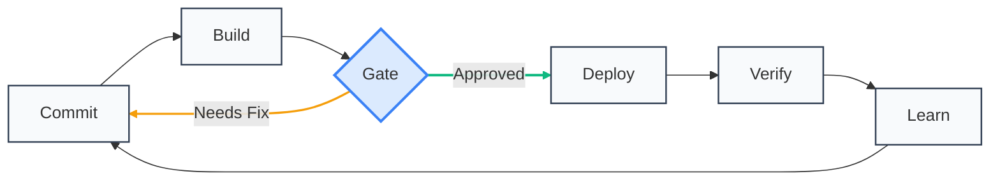

## Why Teams Adopt CI/CD (and Why They Abandon It)

| What Teams *Say* They Want | What They *Actually* Experience |
|----------------------------|---------------------------------|
| "Faster releases" | ❌ Endless gate debates |
| "Secure by default" | ❌ Last-minute security fire drills |
| "Confident deployments" | ❌ "Who broke production?" blame cycles |

> **Truth**: CI/CD fails when designed for *machines*, not humans.  
> This framework rebuilds the workflow around **cognitive load**, **psychological safety**, and **shared ownership**.

---

## The 6-Stage Learning Loop

🔍 **Designed for human cognition**:  
- 🟢 **Green path** = Forward momentum (psychological reward)  
- 🟠 **Amber path** = Safe correction loop (no shame cycle)  
- 🔵 **Blue gate** = Collaborative decision point (not a bottleneck)  
- 🔁 **Circular flow** = Learning is continuous (not "done after deploy")

---

## Three Non-Negotiable Principles

| Principle | Human Impact | Anti-Pattern Avoided |
|-----------|--------------|----------------------|
| **Security walks beside you** | "I see risks *while* coding—not after" | Security as final gatekeeper |
| **Feedback arrives in <5 minutes** | Context stays fresh; no task-switching tax | "Why did this fail?" mystery emails |
| **One artifact, one truth** | "This exact binary reached users" confidence | "Works on my machine" disputes |

---

## Stage-by-Stage: Purpose Over Process

### 🔒 Stage 1: Commit Validation  
*Where safety begins—not where speed ends*  
- **Purpose**: Catch preventable issues *before* build resources consume attention  
- **Critical actions**:  
  - Verify commit signature (authorized contributor)  
  - Scan dependency licenses (block GPL in proprietary projects)  
  - *Concept example*: Snyk’s methodology—flag vulnerable dependencies *at commit*  
- **Pass criteria**: Zero critical license conflicts; signed commit  
- **Human signal**: ✅ *"Safe to invest build time"*

### 🏗️ Stage 2: Build & Early Validation  
*Create one trusted artifact—once*  
- **Purpose**: Establish immutable truth for all downstream stages  
- **Critical actions**:  
  - Generate cryptographically signed artifact  
  - Embed security validation (SAST/SCA concepts)  
  - Record build metadata (who, when, dependencies)  
- **Pass criteria**: Artifact signed; critical flaws = fail  
- **Human signal**: 🔐 *"This binary is our single source of truth"*

### ⚖️ Stage 3: Progressive Promotion Gate  
*Collaborative risk decision—not a blockade*  
- **Purpose**: Apply risk-appropriate rigor (not one-size-fits-all)  
- **Critical actions**:  
  - Evaluate against policy:  
    - `Critical CVE` → Block  
    - `Medium CVE` → Track + notify  
    - `Low risk` → Proceed  
  - *Optional*: Compliance hold (e.g., SOC2 manual approval)  
- **Pass criteria**: Policy thresholds met; approvals secured  
- **Human signal**: 🤝 *"We collectively own this risk decision"*

### 🚀 Stage 4: Environment-Agnostic Deployment  
*Release with confidence, not anxiety*  
- **Purpose**: Eliminate environment-specific surprises  
- **Critical actions**:  
  - Inject environment config *after* build (secrets never in artifact)  
  - Execute deployment strategy per policy (blue/green/canary)  
  - Verify rollback readiness  
- **Pass criteria**: Deployment strategy confirmed; rollback path validated  
- **Human signal**: 🔄 *"I can safely revert in <60 seconds"*

### 👁️ Stage 5: Runtime Verification  
*Confirm reality matches expectation*  
- **Purpose**: Validate production behavior—not just deployment success  
- **Critical actions**:  
  - Check health endpoints  
  - Scan for leaked secrets/config drift  
  - Validate security posture (WAF rules, auth flows)  
- **Pass criteria**: All health checks green; zero critical anomalies  
- **Human signal**: 🌐 *"Production is behaving as intended"*

### 📈 Stage 6: Observability Loop  
*Turn data into collective wisdom*  
- **Purpose**: Close the learning cycle  
- **Critical actions**:  
  - Feed failure patterns to development team  
  - Update security policies automatically  
  - Measure DORA metrics (deployment frequency, failure rate)  
- **Human signal**: 🌱 *"We improved because of this cycle"*

---

## Adapting Rigor to Project Risk (No Over-Engineering)

| Project Type | Gate Strictness | Manual Approval? | Feedback Speed |
|--------------|-----------------|------------------|----------------|
| Internal tool | Block only critical | ❌ Never | <2 min |
| Customer-facing app | Track medium risks | ⚠️ Optional | <5 min |
| Regulated system (fintech/health) | Block medium+ | ✅ Required | <10 min |

> **Key insight**: Rigor scales with *business impact*—not technical complexity.  
> Honor the difference between a payroll system and an internal dashboard.

---

## Why This Framework Endures

- ✨ **Tool-agnostic**: Describes *what* happens—not *which button to click*  
- 🌱 **Psychologically safe**: "Fix" loops = learning opportunities, not failures  
- 📏 **Measurable**: Track cycle time, failure rate, MTTR  
- 🤝 **Human-first**: Designed for how teams *actually* work  

> "Automation without empathy creates friction.  
> This workflow makes security a teammate."  
> — *Synthesized from OWASP DevSecOps Guideline §4.2*
