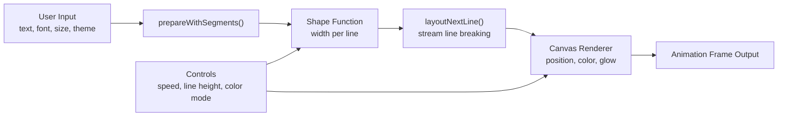

> Live demo: <https://hubertlim.github.io/GlyphFlow/>  
> Source code: <https://github.com/hubertlim/GlyphFlow>
{: .prompt-info }

GlyphFlow started with a simple question: can browser text behave more like a fluid visual material than a static block of content?

Most browser text effects animate around layout. They translate, scale, fade, or skew an already-computed text box. I wanted something more structural. I wanted the text itself to be recomputed into different shapes as it moved, while staying interactive and smooth enough to feel like a tool rather than a demo.

That requirement immediately ruled out the usual DOM-heavy approach.

## The Problem

If you try to build animated text geometry with ordinary DOM measurement, you quickly hit the wrong abstraction level.

The naive plan looks attractive:

1. Measure the text.
2. Pick a width for each line.
3. Reflow the content.
4. Repeat every animation frame.

The problem is that browser layout is not designed to be pushed through that loop continuously. Once you rely on DOM measurement for every frame, you introduce layout work, style recalculation, and unpredictable performance behavior. That may be acceptable for a decorative effect, but it is not a good foundation for a responsive editor.

For GlyphFlow, I wanted a few constraints to hold at the same time:

- The app had to run entirely in the browser.
- It had to deploy cleanly to GitHub Pages.
- It had to support multilingual text, including emoji and non-Latin scripts.
- It had to animate line shapes continuously without visible stutter.
- The implementation had to stay small enough to understand and extend.

Those constraints pushed the project toward Canvas and away from DOM layout.

## The Core Idea

The key idea in GlyphFlow is simple:

> Instead of animating a finished text block, animate the width available to each line and let the text reflow into a new shape.

That sounds small, but it changes the whole mental model. The application does not think in terms of one paragraph box. It thinks in terms of a stream of lines where each line gets its own width budget.

If those width budgets change over time, the paragraph reshapes itself.

That is how GlyphFlow produces patterns like:

- sine waves
- funnels
- diamonds
- hourglasses
- stair-step patterns
- collapsing waveforms

Each shape is just a function that returns a line width for a given line index and time value.

## Why Pretext Was the Unlock

The project became practical because of [Pretext](https://github.com/chenglou/pretext), a JavaScript library by Cheng Lou for text measurement and multiline layout.

The most important part for GlyphFlow is not that Pretext lays out text. Browsers already do that. The important part is how it does it.

Pretext lets the application:

- prepare the text once for a specific font
- measure segments with Canvas instead of DOM layout
- stream line breaking through `layoutNextLine()`
- treat layout as a pure function of prepared text and width

That last point is the entire project.

When layout becomes a function of `(preparedText, width)`, you can recompute it again and again inside an animation loop. That would be a bad fit for DOM reflow. It is a very good fit for a pure, Canvas-oriented pipeline.

## High-Level Architecture



The pipeline is intentionally narrow:

1. Prepare the text for the active font.
2. Compute a width for each line.
3. Ask Pretext for the next valid line under that width.
4. Render the line to Canvas.
5. Repeat on every frame.

The app does not need a framework because the rendering model is already explicit.

## Preparing Text Once, Reusing It Many Times

The layout step begins by preparing the text with the selected font:

```js
const text = textInput.value
const font = `${fontSize}px "${fontFamily}"`
const prepared = prepareWithSegments(text, font)
```

This matters because GlyphFlow should not rediscover the text structure from scratch through DOM queries. Once the text is prepared, the app can ask Pretext to generate line after line for different widths.

That is what makes the animation loop feasible.

## Turning Width Into Shape

At the center of the project is a family of width functions:

```js
function getLineWidth(shape, i, total, base, t) {
  const norm = total > 1 ? i / (total - 1) : 0.5

  switch (shape) {
    case 'sine':
      return base * (0.5 + 0.4 * Math.sin(norm * Math.PI * 2 + t))
    case 'diamond':
      return base * (0.3 + 0.7 * (1 - Math.abs(norm * 2 - 1)))
    case 'hourglass':
      return base * (0.3 + 0.65 * Math.abs(norm - 0.5) * 2)
    default:
      return base
  }
}
```

This function family is where GlyphFlow stops being just a text renderer and becomes a visual system.

Each shape is defined by how it distributes width across the vertical stack of lines:

- `sine` creates oscillation and motion
- `diamond` narrows the top and bottom while expanding the center
- `hourglass` does the reverse
- `staircase` creates stepped rhythm rather than smooth curvature
- `collapse` combines a wave with decay to produce a shrinking form

The important design choice is that shapes are deterministic and cheap. They do not require geometry libraries, collision systems, or particle engines. They only need line index, total line estimate, base width, and time.

## Streaming Layout Inside the Render Loop

Once a width exists for the current line, the app asks Pretext for the next line that fits:

```js
const lines = []
let cursor = { segmentIndex: 0, graphemeIndex: 0 }

for (let i = 0; i < maxLines; i++) {
  const width = getLineWidth(shape, i, maxLines, baseWidth, time)
  const line = layoutNextLine(prepared, cursor, Math.max(width, 40))

  if (!line) break

  lines.push({ ...line, usedWidth: width })
  cursor = line.end
}
```

This loop is the actual engine of GlyphFlow.

Instead of asking the browser to lay out a paragraph box and then decorating it, the app performs line breaking directly against widths generated by the active shape. The result is a sequence of lines that already belong to the visual form.

That sequence is then drawn to Canvas.

## Rendering on Canvas

The rendering phase is straightforward by design:

- resize the canvas to the container
- account for device pixel ratio
- center the text block vertically
- center each line horizontally within its own width
- assign color based on width ratio and active color mode
- apply optional glow
- draw subtle guide lines for the current shape envelope

The line rendering itself is intentionally plain:

```js
ctx.font = font
ctx.fillStyle = getLineColor(colorMode, i, lines.length, widthRatio)
ctx.globalAlpha = 0.45 + 0.55 * widthRatio
ctx.fillText(line.text, x, startY + i * lineH)
```

The visual richness comes from recomputed layout, not from complicated drawing primitives.

That distinction is important. GlyphFlow looks dynamic because the text structure changes, not because the renderer is overloaded with visual tricks.

## Why the App Feels Smooth

Several small decisions combine to make the animation feel stable:

### 1. The renderer uses `requestAnimationFrame`

That keeps updates aligned with the browser's paint cycle.

### 2. Canvas resolution is scaled by device pixel ratio

This keeps the output crisp on higher-density displays.

### 3. Shapes transition smoothly

When the active shape changes, GlyphFlow captures the previous set of widths and interpolates into the new one over a short transition window. That prevents abrupt layout jumps and makes the editor feel intentional.

### 4. The app uses a narrow runtime model

There is no component tree to diff, no framework scheduler to coordinate, and no layout thrash from repeatedly querying rendered DOM nodes. For this use case, fewer layers is a performance feature.

## Color and Motion as Secondary Systems

Once the shaping model was working, color became a second, composable layer instead of the primary attraction.

GlyphFlow includes modes like:

- gradient
- rainbow
- thermal
- ocean
- neon
- sunset
- forest
- cyberpunk

These do not change layout. They map line position and width ratio into color decisions. That separation turned out to be useful because it kept the project modular:

- shape controls geometry
- color controls mood
- typography controls voice
- presets combine them into reusable compositions

That gave the editor a better UX than exposing dozens of disconnected controls.

## Multilingual Text Was a Non-Negotiable Requirement

One of the easiest ways to accidentally narrow a browser experiment is to build it around English-only assumptions.

GlyphFlow explicitly includes multilingual presets because I wanted to confirm that the layout approach was not limited to simple Latin text. The app handles combinations of:

- Latin text
- CJK characters
- Arabic text
- emoji

That does not mean every type system edge case is solved forever. It does mean the architecture is not hard-coded to an ASCII worldview, which is an important difference for any text-heavy creative tool.

## Why Vanilla JavaScript and Vite Were the Right Tradeoff

GlyphFlow uses a deliberately small stack:

- Vite for development and static builds
- vanilla JavaScript for application logic
- Canvas API for rendering
- Docker for reproducible local startup
- GitHub Pages for hosting

I chose that stack because the core problem was rendering and layout, not application state orchestration.

A framework could have been added, but it would not have solved the hard part of the project. In fact, it might have made the system harder to explain. For a portfolio application, explainability matters almost as much as the final result.

## What I Learned

Three lessons stood out while building GlyphFlow.

### 1. Performance problems are often abstraction problems

The first question was not "How do I optimize text animation?" It was "Am I asking the browser to solve the wrong problem?" Once the model shifted from DOM layout to prepared text plus width functions, the performance story improved naturally.

### 2. Small projects benefit from narrow ideas

GlyphFlow works because it is opinionated. It does not try to be a full design suite. It does one thing well: reshape text into animated forms in real time.

### 3. Good visual tools still need a technical thesis

Without the layout model, GlyphFlow would only be a nice interactive page. The thing that makes it portfolio-worthy is the engineering idea behind it.

## Current Tradeoffs

The project works well, but there are still limits worth stating plainly:

- The current implementation is concentrated in one main source file, which is fine for speed but not ideal for long-term maintainability.
- There are no automated performance benchmarks yet, only runtime behavior and visual inspection.
- The mobile experience can be improved further, especially around control density.
- Export is currently PNG-only, so there is no frame sequence or video pipeline.

Those are good next steps because they improve the product without changing the core architecture.

## Where I Would Take It Next

If I continue developing GlyphFlow, the next iteration would likely focus on four areas:

1. Split the code into `shapes`, `colors`, `renderer`, and `ui` modules.
2. Add keyboard shortcuts and faster preset switching.
3. Introduce more formal performance measurement.
4. Add export options for animation, not only still frames.

None of those require changing the original idea. They build on it.

## Final Thought

GlyphFlow was a useful reminder that interesting front-end engineering does not always come from bigger stacks or more dependencies. Sometimes it comes from finding the one abstraction that lets the browser do less unnecessary work.

In this case, that abstraction was simple:

prepare the text once, treat line width as the animated variable, and render the result directly to Canvas.

That turned a typography experiment into a usable application.
