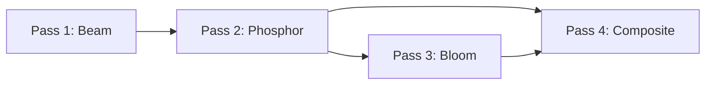

> Live demo: <https://hubertlim.github.io/oscilloscope_playground/>
> Source code: <https://github.com/hubertlim/oscilloscope_playground>
{: .prompt-info }

Vintage oscilloscopes have a look that's hard to fake. The phosphor coating on the CRT glows where the electron beam hits, fades slowly over time, and bleeds light into surrounding pixels. That persistence and bloom is what gives oscilloscope traces their characteristic warmth.

I wanted to recreate that look in the browser. Not as a post-processing filter on top of a line, but as a physically-inspired rendering pipeline where each frame's energy accumulates, decays, and blooms the way real phosphor does.

The result is **Phosphor**, a web-based oscilloscope simulator with 5 signal modes, real-time audio visualization, and a 4-pass GLSL shader pipeline. This post walks through how the rendering works.

## The Pipeline



Each frame goes through four shader passes:

1. **Beam** — Render signal points as soft gaussian dots with additive blending
2. **Phosphor** — Accumulate beam energy with exponential decay (HDR)
3. **Bloom** — Two-pass Gaussian blur at half resolution
4. **Composite** — Tone mapping, CRT curvature, vignette, scanlines, grid

The key design decision: **the phosphor buffer stays in linear HDR space**. Tone mapping only happens once, in the composite pass. This prevents the accumulation artifacts you get when you tone-map per frame.

## Pass 1: Beam

The beam shader renders each signal point as a soft gaussian dot using `gl_PointCoord`. Each point has two components: a tight core and a softer glow halo.

```glsl
vec2 coord = gl_PointCoord - vec2(0.5);
float dist = length(coord);

float core = exp(-dist * dist * 28.0);
float glow = exp(-dist * dist * 8.0) * 0.3;
float shape = core + glow;

float brightness = shape * vIntensity * 0.7;
gl_FragColor = vec4(uBeamColor * brightness, brightness);
```

The `core` gaussian (sigma ≈ 0.19) gives the sharp bright center. The `glow` gaussian (sigma ≈ 0.35) adds the softer halo around it. With 4096 points rendered per frame using additive blending, overlapping regions accumulate naturally — dense parts of the trace glow brighter, just like a real CRT.

The output goes to a HalfFloat texture. This is important: standard 8-bit textures would clip at 1.0 and lose the HDR information we need for realistic phosphor behavior.

## Pass 2: Phosphor Persistence

This is where the magic happens. The phosphor shader reads the previous frame's phosphor buffer, applies exponential decay, and adds the new beam energy:

```glsl
vec4 current = texture2D(uCurrentFrame, vUv);
vec4 previous = texture2D(uPreviousFrame, vUv);

vec4 decayed = previous * uDecay;
vec4 combined = decayed + current;
combined = min(combined, vec4(2.5));

gl_FragColor = combined;
```

The `uDecay` uniform (typically 0.85–0.95) controls how long traces persist. At 0.95, a trace takes about 60 frames to fade to near-zero — roughly one second at 60fps, which matches the persistence of P31 phosphor used in many real oscilloscopes.

The `min(combined, 2.5)` clamp prevents infinite accumulation. Without it, a stationary beam would push values toward infinity. The ceiling of 2.5 is chosen so the composite shader's Reinhard tone mapping still has headroom to work with.

This pass uses a ping-pong buffer: two HalfFloat render targets that swap each frame. The previous frame's output becomes the next frame's input.

## Pass 3: Bloom

The bloom pass creates the characteristic CRT glow by blurring the phosphor buffer. It uses a separable 13-tap Gaussian blur in two passes (horizontal, then vertical) at half resolution:

```glsl
float weights[7];
weights[0] = 0.1964825501511404;
weights[1] = 0.2969069646728344;
weights[2] = 0.2195956136;
// ...

for (int i = -6; i <= 6; i++) {
    float weight = weights[abs(i)];
    vec2 offset = uDirection * texelSize * float(i);
    sum += texture2D(uTexture, vUv + offset) * weight;
    totalWeight += weight;
}
```

Running at half resolution is a deliberate choice: it makes the blur wider (each texel covers 2x2 pixels) while using the same number of taps, and it's cheaper to compute. The slight softness from the downscale actually helps — real CRT bloom isn't sharp.

## Pass 4: Composite

The composite shader is where everything comes together. It samples both the phosphor buffer and the bloom texture, combines them in linear HDR space, then applies tone mapping and CRT effects:

```glsl
vec3 hdr = phosphor + bloom * uBloomIntensity;

// Reinhard tone mapping — the ONLY place this happens
float exposure = 1.5;
vec3 color = hdr * exposure;
color = color / (1.0 + color);
```

Reinhard tone mapping (`x / (1 + x)`) compresses HDR values into displayable range while preserving relative brightness. Bright areas stay bright, dim areas stay dim, and nothing clips. The exposure of 1.5 makes traces visibly bright without washing out.

After tone mapping, the shader applies CRT effects:

- **Barrel distortion** — simulates the curved glass of a CRT
- **Scanlines** — horizontal brightness modulation at display resolution
- **Grid overlay** — the 10×10 graticule with major axis lines
- **Vignette** — darkening toward the edges
- **Ambient glass glow** — a subtle green tint (`vec3(0.0, 0.003, 0.0)`) that simulates light scattering in the glass

## Why HDR Matters

The single most important decision in this pipeline is keeping everything in linear HDR space until the final composite pass.

Here's what happens if you tone-map per frame instead:

1. Frame 1: beam outputs 1.5 → tone mapped to 0.6
2. Frame 2: decayed 0.6 × 0.9 = 0.54, add new beam 1.5 → 2.04 → tone mapped to 0.67
3. Frame 3: decayed 0.67 × 0.9 = 0.6, add new beam 1.5 → 2.1 → tone mapped to 0.68

The values converge to a fixed point instead of accumulating naturally. The phosphor persistence looks flat and lifeless.

With HDR accumulation:

1. Frame 1: beam outputs 1.5 → stored as 1.5
2. Frame 2: decayed 1.5 × 0.9 = 1.35, add new beam 1.5 → 2.85 (clamped to 2.5)
3. Composite: tone map 2.5 → 0.79

The accumulation is real. Dense, persistent traces genuinely glow brighter than transient ones. The tone mapping at the end preserves the dynamic range while keeping everything displayable.

## Audio Visualization

Phosphor includes four audio display modes that feed signal data into the same rendering pipeline:

- **Waveform** — time-domain display using `AnalyserNode.getByteTimeDomainData()`
- **Spectrum** — FFT with logarithmic frequency scale using `getByteFrequencyData()`
- **X-Y** — stereo oscilloscope (left channel → X, right channel → Y)
- **Radial** — circular spectrum with beat detection

The audio modes use the Web Audio API's `AnalyserNode` for FFT analysis. Auto-gain scales weak signals to fill the screen. You can drag-and-drop audio files or use your microphone.

## Performance

The pipeline runs comfortably at 60fps on integrated GPUs. The main costs are:

- **Beam pass**: 4096 point sprites with additive blending — cheap
- **Phosphor pass**: Full-screen quad with two texture reads — cheap
- **Bloom pass**: Two half-resolution blur passes, 13 taps each — moderate
- **Composite pass**: Full-screen quad with math — cheap

The HalfFloat textures are the biggest memory cost (4 of them at full resolution), but modern GPUs handle this without issue.

## Try It

The whole thing runs in the browser. No install needed:

**[→ Live Demo](https://hubertlim.github.io/oscilloscope_playground/)**

Or run it locally with Docker:

```bash
git clone https://github.com/hubertlim/oscilloscope_playground.git
cd oscilloscope_playground
docker compose up --build
```

The source is MIT licensed. If you're interested in the shader code, start with the [shaders directory](https://github.com/hubertlim/oscilloscope_playground/tree/main/frontend/src/shaders).
