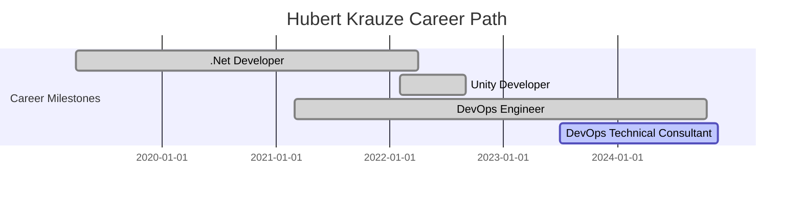

---
# the default layout is 'page'
icon: fas fa-info-circle
order: 4
mermaid: true
---

## 🖥️ **Professional Summary:**

Experienced and detail-oriented DevOps Engineer with a strong focus on **Microsoft Azure** environments, complemented by a solid background in **L3 Customer Support**, **Gamedev** and **Software Development**. **Cybersecurity** enthusiast. Demonstrated ability to bridge the gap between technical teams and end-users, ensuring seamless operations, cloud infrastructure optimization, and prompt issue resolution. Adept at deploying and maintaining Azure resources, automating workflows, and enhancing customer experiences through technical support. Eager to contribute my combined expertise in DevOps and customer service to drive operational efficiency and customer satisfaction.

---

## 🛠️ **Career Path:**

- 📖 DevOps Technical Consultant : LEOCODE
- ⚙️ DevOps Engineer : CSHARK/Fenergo
- 🎮 Unity Developer : Forever Entertainment S.A.
- 🌐 .Net Developer : 4EVOLVE Systems

### 🏁 **Career Timeline:**

**If the diagram is not fully visible, then I recommend switching to light mode.*